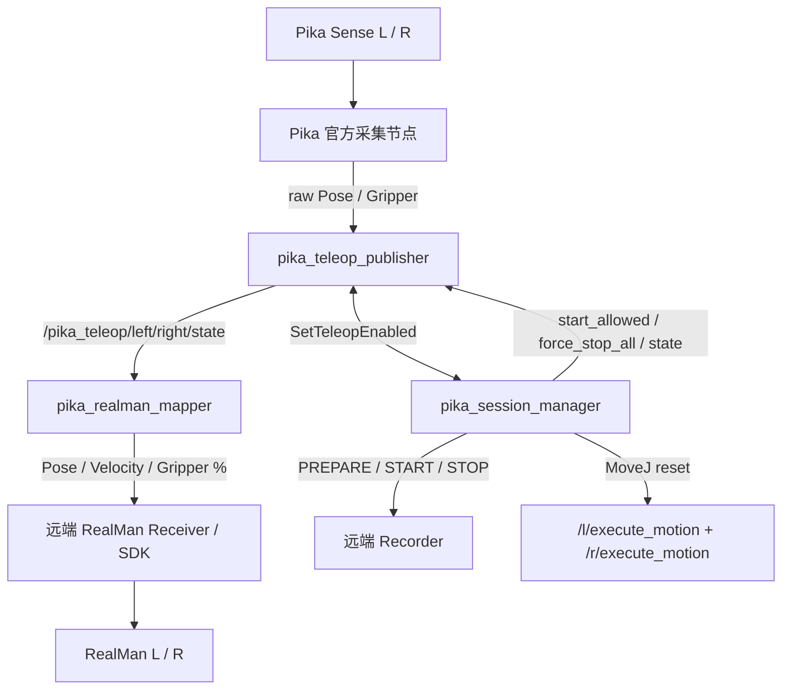
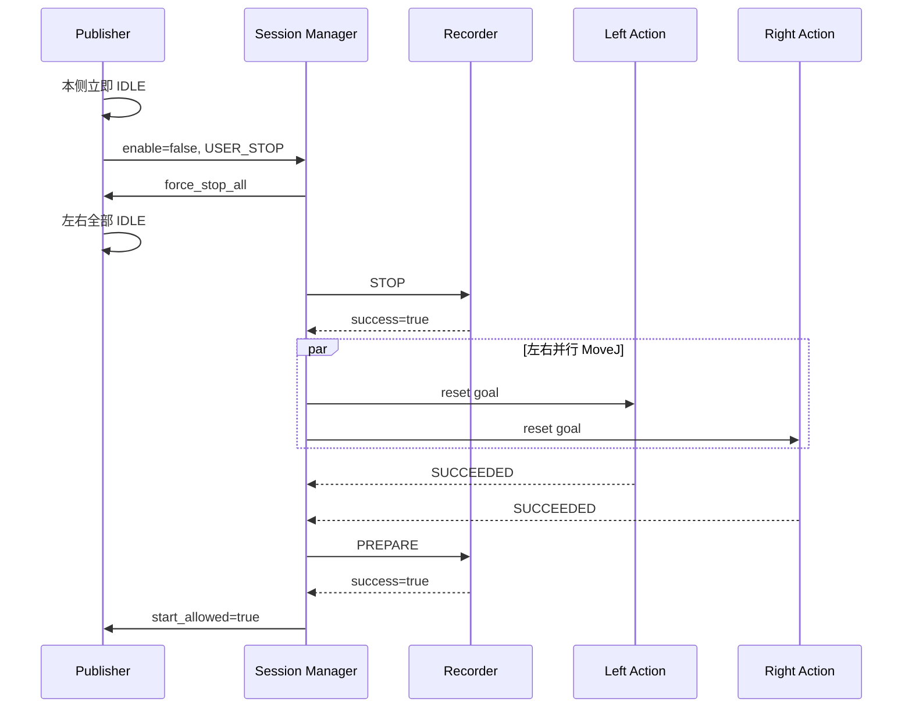

# Pika 双手遥操与 RealMan 数据采集系统

本项目是一个基于 ROS 2 Humble 的双手遥操与示教数据采集软件栈。系统接收两只 Pika Sense 的位姿和夹爪数据，完成手势启停、安全检查、坐标变换、相对位姿映射、全局录制 episode 管理，并在一次正常示教结束后协调左右 RealMan 机械臂并行回到固定默认零位。

项目的核心目标是：

> 每条示教从固定机械臂零位开始；第一次 Pika START 创建一个全局 Recording Episode；左右手可以独立加入同一 episode；任一正常 USER_STOP 结束整条 episode，先停止遥操和录制，再让左右机械臂回零；只有双臂回零和 Recorder PREPARE 都成功后，才允许开始下一条数据。

## 目录

- [主要功能](#主要功能)
- [系统边界](#系统边界)
- [总体架构](#总体架构)
- [Package 说明](#package-说明)
- [数据流与状态机](#数据流与状态机)
- [手势与安全机制](#手势与安全机制)
- [坐标和相对位姿映射](#坐标和相对位姿映射)
- [ROS 2 接口](#ros-2-接口)
- [共享配置](#共享配置)
- [环境要求](#环境要求)
- [构建方法](#构建方法)
- [正式运行方法](#正式运行方法)
- [Bag/Demo 模式](#bagdemo-模式)
- [操作流程](#操作流程)
- [验收与数据观察](#验收与数据观察)
- [数据保存位置](#数据保存位置)
- [Virtual Receiver 测试模式](#virtual-receiver-测试模式)
- [正常日志说明](#正常日志说明)
- [报错和异常处理](#报错和异常处理)
- [真机安全注意事项](#真机安全注意事项)
- [当前验证状态](#当前验证状态)
- [上传 GitHub 建议](#上传-github-建议)

## 主要功能

### 双 Sense 数据接入

- 同时接收左右 Pika Sense 的 Pose 和 Gripper 数据。
- 左右输入、手势、状态机、位姿跳变保护和速度估计相互独立。
- 以 100 Hz 发布标准化的左右 `PikaTeleopState`。
- 保留原始 source timestamp，并输出 Pose/Gripper 数据年龄。

### 手势启停

- IDLE 状态下双击夹爪，申请本侧 START。
- ACTIVE 状态下三击夹爪，结束整条全局 episode。
- START 使用异步 Service，不阻塞 100 Hz Publisher timer。
- Recorder 尚未确认 START 时，本侧保持 `PENDING_START`，不会提前输出有效控制状态。

### Session 与录制管理

- 启动时自动执行 Recorder `PREPARE`，但不移动机械臂。
- 第一只手 START 时创建一次全局 Recording Session。
- 第二只手随后 START 时加入同一个 `session_id`，不会再次调用 Recorder START。
- 任意 ACTIVE 侧正常 USER_STOP 时结束全局 episode。
- 管理 `/pika_session/start_allowed`，禁止在 STOP、RESET、PREPARE 或 FAILED 阶段启动新一轮。

### 固定零位相对映射

- Mapper 不读取 RealMan `/tf`。
- 每次 START 使用当前 Pika Pose 作为 Pika 起点。
- 使用共享配置中的固定 RealMan TCP Pose 作为目标起点。
- 第一条笛卡尔目标等于配置中的固定 TCP Pose。
- 后续目标始终从两个固定 session 起点计算，不逐帧累计，避免累计漂移。

### 正常结束后的双臂回零

- 先强制左右 Pika Teleop 停止。
- Recorder STOP 成功后才发送机械臂复位 Action，避免复位动作进入示教数据。
- 左右 `/l/execute_motion`、`/r/execute_motion` 并行执行 MoveJ。
- 两侧 Action 都成功后重新执行 Recorder PREPARE。
- PREPARE 成功后才恢复下一轮 START。

### 异常安全停止

- Sense 数据 stale 或位姿跳变时立即清除遥操控制状态。
- `STALE_STOP`、`POSE_JUMP_STOP` 会停止 Recorder，但不会自动执行机械臂 MoveJ。
- 异常 episode 进入 `FAILED`，需要人工检查现场并重启 Session Manager。
- Mapper 和远端 RealMan Receiver 使用独立 watchdog，防止断流后继续执行旧目标。

## 系统边界

本仓库负责：

- Pika 官方消息接入；
- 双击/三击手势；
- Sense freshness、有限值和 PoseJump 检查；
- 标准化 Teleop state；
- 全局 Recording episode 状态机；
- 固定零位相对位姿映射；
- 正常停止后的左右 MoveJ 复位协调；
- 本地纯 ROS 验收工具。

本仓库不负责：

- RealMan SDK 实时控制；
- 机械臂 IK/FK、碰撞检测、工作空间限制和急停；
- 远端 Recorder 的具体数据目录和文件格式；
- 自动 ADOPT/DISCARD 数据；
- 本地 rosbag 录制；
- 异常 STOP 后的自动机械臂复位。

远端 RealMan 工控机仍需提供：

- `/recording/manage`；
- `/l/execute_motion`；
- `/r/execute_motion`；
- RealMan command receiver / SDK；
- command receive watchdog、限速、限位、碰撞和急停保护。

## 总体架构



安全职责分层如下：

| 层 | 主要职责 |
|---|---|
| Pika 官方节点 | 读取 Sense 硬件并发布原始 Pose/Gripper |
| Publisher | 手势、freshness、NaN/Inf、PoseJump、状态机、100 Hz 标准 state |
| Session Manager | 全局录制 episode、START gate、正常 STOP 后复位、FAILED 管理 |
| Mapper | 固定零位相对映射、state watchdog、目标速度与夹爪百分比 |
| RealMan Receiver | command watchdog、限速、限位、SDK 控制和机器人安全 |

## Package 说明

```text
pika_teleop_ws/
├── README.md
└── src/
    ├── pika_teleop_interfaces/
    ├── pika_teleop_bridge/
    ├── pika_session_manager/
    ├── pika_realman_mapper/
    ├── pika_teleop_bringup/
    ├── pika_teleop_virtual_receiver/
    ├── realman_msgs/
    └── realman_recording_msgs/
```

| Package | 类型 | 作用 |
|---|---|---|
| `pika_teleop_interfaces` | `ament_cmake` | 定义 `PikaTeleopState.msg` 和 `SetTeleopEnabled.srv` |
| `pika_teleop_bridge` | `ament_python` | Pika 输入、手势、安全检查、坐标转换、速度估计和 state 发布 |
| `pika_session_manager` | `ament_python` | Recorder、全局 episode、START gate 和双臂复位状态机 |
| `pika_realman_mapper` | `ament_python` | Pika 相对运动到 RealMan 固定零位目标的映射 |
| `pika_teleop_bringup` | `ament_python` | 正式模式与 Bag/Demo 模式的独立配置和一键 launch |
| `pika_teleop_virtual_receiver` | `ament_python` | 不连接真机的 Bridge Service/state 验收工具 |
| `realman_msgs` | 接口包 | RealMan Action、Service 和 Message 定义 |
| `realman_recording_msgs` | 接口包 | Recorder Service、Action 和状态消息定义 |

关键入口文件：

- [正式一键 Launch](src/pika_teleop_bringup/launch/pika_teleop.launch.py)
- [Bag/Demo Launch](src/pika_teleop_bringup/launch/pika_bag.launch.py)
- [共享参数配置](src/pika_teleop_bringup/config/ros/pika_config.yam)
- [Bag/Demo 参数配置](src/pika_teleop_bringup/config/ros/pika_bag_config.yam)
- [Session Manager](src/pika_session_manager/pika_session_manager/node.py)
- [Pika Teleop Publisher](src/pika_teleop_bridge/pika_teleop_bridge/node.py)
- [RealMan Mapper](src/pika_realman_mapper/pika_realman_mapper/node.py)
- [标准 State 接口](src/pika_teleop_interfaces/msg/PikaTeleopState.msg)
- [启停 Service 接口](src/pika_teleop_interfaces/srv/SetTeleopEnabled.srv)
- [RealMan 复位 Action 接口](src/realman_msgs/action/ExecuteMotion.action)
- [Recorder 管理 Service 接口](src/realman_recording_msgs/srv/ManageRecording.srv)

正式 executable：

| Package | Executable | Node name |
|---|---|---|
| `pika_teleop_bridge` | `pika_teleop_publisher` | `pika_teleop_publisher` |
| `pika_session_manager` | `pika_session_manager` | `pika_session_manager` |
| `pika_realman_mapper` | `pika_realman_mapper` | `pika_realman_mapper` |
| `pika_teleop_virtual_receiver` | `virtual_receiver` | `pika_teleop_virtual_receiver` |

## 数据流与状态机

### 初始启动

```text
pika_session_manager 启动
  → state=PREPARING
  → start_allowed=false
  → 等待 /recording/manage
  → Recorder PREPARE
  → PREPARE success
  → state=READY
  → start_allowed=true
```

初始 PREPARE 只准备 Recorder，不会自动移动机械臂。

### 第一只手 START

```text
IDLE
  → 双击
  → Publisher 检查数据和 start_allowed
  → PENDING_START
  → SetTeleopEnabled(enable=true, reason=USER_START)
  → Session Manager: READY → STARTING
  → Recorder START
  → Recorder 返回 success=true, state=RECORDING
  → 保存 session_id
  → Session Manager: RECORDING
  → Publisher: ACTIVE
```

Recorder 没有确认成功前，Publisher 不会进入 ACTIVE。

### 第二只手加入

若当前已经是 `RECORDING`，另一只手双击后：

- 直接加入当前 `session_id`；
- 对应侧进入 ACTIVE；
- 不调用第二次 Recorder START；
- 第一只手保持 ACTIVE。

合法状态示例：

```text
Recording = RECORDING
LEFT      = ACTIVE
RIGHT     = IDLE
```

### 正常 USER_STOP

任意一个当前 ACTIVE 的 Sense 三击都会结束整条全局 episode：



状态变化：

```text
RECORDING
  → STOPPING
  → RESETTING
  → PREPARING
  → READY
```

### 异常 STOP

当 ACTIVE 期间出现 `STALE_STOP` 或 `POSE_JUMP_STOP`：

```text
强制左右 Teleop 停止
  → Recorder STOP
  → 不发送 MoveJ
  → FAILED
  → start_allowed=false
```

禁止在 Sense 数据异常时自动驱动机械臂复位。请人工检查硬件、网络、时间戳和机械臂现场状态后，再重启 Session Manager。

### Session Manager 状态

| 状态 | `start_allowed` | 含义 |
|---|---:|---|
| `PREPARING` | false | 正在等待或调用 Recorder PREPARE |
| `READY` | true | 可以开始新 episode |
| `STARTING` | false | 正在等待 Recorder START |
| `RECORDING` | true | episode 已录制，允许另一侧加入 |
| `STOPPING` | false | 正在停止 Recorder |
| `RESETTING` | false | 正在并行复位左右机械臂 |
| `FAILED` | false | 发生需要人工处理的错误 |

## 手势与安全机制

### 手势定义

一次 click 是完整的“开 → 合 → 开”。

| 当前状态 | 手势 | 结果 |
|---|---|---|
| IDLE | 双击 | 申请本侧 USER_START |
| ACTIVE | 三击 | 本侧立即 IDLE，并请求全局 USER_STOP |
| PENDING_START | 任意新手势 | 暂不处理，等待 Service response 或 timeout |

默认夹爪手势参数：

| 参数 | 默认值 | 含义 |
|---|---:|---|
| `gripper_open_threshold` | `0.075` | 判定张开 |
| `gripper_close_threshold` | `0.025` | 判定闭合 |
| `click_max_interval_ms` | `450` | click 时序最大间隔 |
| `gesture_reset_timeout_ms` | `1200` | 未完成手势的重置时间 |

如果真实夹爪数值范围不同，应先观察 `/gripper_l/joint_state`、`/gripper_r/joint_state`，再调整阈值。

### Sense 数据有效条件

一侧数据 usable 需要同时满足：

- Pose 和 Gripper 都已收到；
- 数值均为有限值；
- Pose quaternion 可以归一化；
- Pose 和 Gripper age 均位于 `[0, stale_stop_ms]`；
- 默认 `stale_stop_ms=50 ms`。

### PoseJump

ACTIVE 状态只对新的 raw Pika Pose 检查连续跳变：

- 位置变化大于 `0.08 m`；或
- 最短旋转角大于 `45°`；

任一条件满足都会触发 `POSE_JUMP_STOP`。

### 多层 watchdog

```text
Publisher Sense freshness
  + Mapper state receipt watchdog
  + RealMan Receiver command watchdog
```

Mapper 默认超过 `100 ms` 没有收到新 state 就停止输出，并要求先观察到 `enabled=false` 才能重新建立 session，避免数据恢复后自动续接旧运动。

## 坐标和相对位姿映射

### Publisher 坐标转换

原始 Pika 坐标：

- `+X_old`：夹爪前方；
- `+Y_old`：向左；
- `+Z_old`：向上。

Publisher 输出 `pika_teleop_frame`：

```text
x_new = -z_old
y_new =  y_old
z_new =  x_old
```

即输出定义为：

- `+X_new`：向下；
- `+Y_new`：向左；
- `+Z_new`：向前。

### Mapper 固定零位

每侧第一次收到 `enabled=true && valid=true` 时锁存：

```text
Pika_start_pose = 当前 state.pose
RM_start_pose   = 配置中的 default TCP pose
```

平移映射：

```text
delta_p_pika = p_current - p_start
delta_p_base = scale * R_base_from_pika * delta_p_pika
p_target = p_rm_default + delta_p_base
```

姿态映射：

```text
q_delta_pika = q_current × inverse(q_start)
q_delta_base = q_map × q_delta_pika × inverse(q_map)
q_target = normalize(q_delta_base × q_rm_default)
```

Mapper 内统一使用 `xyzw` 四元数。RealMan `ExecuteMotion` Action 的 Pose 字段使用 `wxyz`，复位 MoveJ 会填合法 identity `[1, 0, 0, 0]`。

默认 Pika→RealMan Base 轴映射为：

```text
q_base_from_pika = [0.70710678, 0.0, -0.70710678, 0.0]

Pika +Z（向前） → RealMan Base -X
Pika +Y（向左） → RealMan Base -Y
Pika +X（向下） → RealMan Base -Z
```

真实机械臂接入前必须低速逐轴核对。左右安装方向不同或现场坐标变化时，应修改配置中的左右 mapping quaternion，不要修改相对映射主算法。

## ROS 2 接口

### Pika 官方输入

| Topic | Type | 说明 |
|---|---|---|
| `/pika_pose_l` | `geometry_msgs/msg/PoseStamped` | 左 Sense Pose |
| `/pika_pose_r` | `geometry_msgs/msg/PoseStamped` | 右 Sense Pose |
| `/gripper_l/joint_state` | `sensor_msgs/msg/JointState` | 左夹爪位置 |
| `/gripper_r/joint_state` | `sensor_msgs/msg/JointState` | 右夹爪位置 |

输入使用 RELIABLE、VOLATILE、KEEP_LAST depth 1。

### 标准 Teleop state

| Topic | Type | QoS / 频率 |
|---|---|---|
| `/pika_teleop/left/state` | `pika_teleop_interfaces/msg/PikaTeleopState` | BEST_EFFORT、VOLATILE、depth 1、100 Hz |
| `/pika_teleop/right/state` | `pika_teleop_interfaces/msg/PikaTeleopState` | BEST_EFFORT、VOLATILE、depth 1、100 Hz |

`PikaTeleopState`：

```text
std_msgs/Header header
geometry_msgs/Pose pose
geometry_msgs/Twist twist
float64 gripper_position

bool enabled
bool valid
bool velocity_valid

builtin_interfaces/Time pose_source_stamp
builtin_interfaces/Time gripper_source_stamp

float32 pose_age_ms
float32 gripper_age_ms
```

字段含义：

- `enabled`：该侧已通过 START 握手并处于 ACTIVE；
- `valid`：该侧 ACTIVE 且当前 Pose/Gripper 可用；
- `velocity_valid`：Twist 已由至少两个合法的新 Pose 样本建立；
- `pose_age_ms`、`gripper_age_ms`：采集数据年龄；
- `header.frame_id`：`pika_teleop_frame`。

### 启停 Service

| Service | Type | Server |
|---|---|---|
| `/pika_teleop/left/set_enabled` | `pika_teleop_interfaces/srv/SetTeleopEnabled` | Session Manager |
| `/pika_teleop/right/set_enabled` | `pika_teleop_interfaces/srv/SetTeleopEnabled` | Session Manager |

```text
bool enable
string reason
---
bool success
string message
```

正式 reason：

- `USER_START`
- `USER_STOP`
- `STALE_STOP`
- `POSE_JUMP_STOP`

Service 是请求/响应接口，不能用 `ros2 topic echo` 监听。应观察 Session Manager 日志、`/pika_session/state` 和 Teleop state 的 `enabled/valid`。

### Session Topics

| Topic | Type | QoS | 说明 |
|---|---|---|---|
| `/pika_session/start_allowed` | `std_msgs/msg/Bool` | RELIABLE、TRANSIENT_LOCAL、depth 1 | 是否允许新 START |
| `/pika_session/force_stop_all` | `std_msgs/msg/Empty` | RELIABLE、VOLATILE、depth 1 | 全局强停事件 |
| `/pika_session/state` | `std_msgs/msg/String` | RELIABLE、TRANSIENT_LOCAL、depth 1 | Session 状态 |

`force_stop_all` 是瞬时 event，订阅者必须在事件发生前启动；它不是 latched topic。

### Mapper 输出

| Topic | Type | Frame / unit |
|---|---|---|
| `/pika/l/cartesian_pose` | `geometry_msgs/msg/PoseStamped` | `l/base_link`，m + xyzw |
| `/pika/r/cartesian_pose` | `geometry_msgs/msg/PoseStamped` | `r/base_link`，m + xyzw |
| `/pika/l/cartesian_velocity` | `geometry_msgs/msg/TwistStamped` | `l/base_link`，m/s + rad/s |
| `/pika/r/cartesian_velocity` | `geometry_msgs/msg/TwistStamped` | `r/base_link`，m/s + rad/s |
| `/pika/l/gripper_percentage` | `std_msgs/msg/Float32` | `[0, 1]` |
| `/pika/r/gripper_percentage` | `std_msgs/msg/Float32` | `[0, 1]` |

这些输出按照 RealMan Receiver 的正式接口约定使用 RELIABLE、VOLATILE、KEEP_LAST depth 1，仅在对应侧 session 有效且 watchdog 正常时持续发布。Mapper 对上游 Teleop state 的订阅仍使用 BEST_EFFORT；输入和输出 QoS 分开定义。

### 外部 Recorder 与 Action

| 接口 | Type | 本项目角色 |
|---|---|---|
| `/recording/manage` | `realman_recording_msgs/srv/ManageRecording` | Service Client |
| `/l/execute_motion` | `realman_msgs/action/ExecuteMotion` | Action Client |
| `/r/execute_motion` | `realman_msgs/action/ExecuteMotion` | Action Client |
| `/recording/status` | `realman_recording_msgs/msg/RecordingStatus` | 配置保留；当前状态机以 Service response 为准 |

Session Manager 自动使用的 Recorder 命令只有 `PREPARE`、`START`、`STOP`，不会自动 ADOPT 或 DISCARD。

## 共享配置

正式配置路径：

```text
/home/lei/pika_teleop_ws/src/pika_teleop_bringup/config/ros/pika_config.yam
```

若仓库部署到其他路径，launch 会从 package share 查找该配置，但官方 Pika 启动命令当前仍固定使用 `/home/lei/pika_ros`。

### 默认固定 TCP

| Side | Position m | Orientation xyzw |
|---|---|---|
| Left | `[-0.323, -0.028, 0.304]` | `[0.990, 0.003, -0.045, -0.137]` |
| Right | `[-0.299, 0.014, 0.319]` | `[0.989, -0.052, -0.047, 0.128]` |

启动 Mapper 时会检查有限值并归一化 quaternion。后续获得更高精度零位时，只修改配置，不修改源码。

### 默认复位关节角

| Side | Joint degrees |
|---|---|
| Left | `[12.172, 25.223, 73.054, -16.703, 80.307, 14.455]` |
| Middle | `[0.0, 17.997, 70.0, 0.0, 90.0, 8.997]` |
| Right | `[-9.89, 18.046, 79.074, 15.505, 79.606, -6.194]` |

当前只自动复位 Left/Right，Middle 只保存配置。

默认复位参数：

```text
velocity_percent = 10
blend_radius_percent = 0
timeout_sec = 120.0
reference = base
connect = false
```

### 重要参数

| Node | 参数 | 默认值 | 说明 |
|---|---|---:|---|
| Publisher | `state_rate_hz` | `100.0` | state 发布频率 |
| Publisher | `stale_stop_ms` | `50.0` | Sense 数据最大年龄 |
| Publisher | `start_service_timeout_ms` | `10000.0` | START Service timeout |
| Publisher | `use_session_gate` | `true` | 正式模式必须开启 |
| Publisher | `max_position_jump_m` | `0.08` | PoseJump 位置阈值 |
| Publisher | `max_rotation_jump_deg` | `45.0` | PoseJump 旋转阈值 |
| Mapper | `command_rate_hz` | `100.0` | 命令刷新率 |
| Mapper | `state_timeout_ms` | `100.0` | state watchdog |
| Mapper | `translation_scale_left/right` | `1.0` | 左右平移比例 |
| Session | `prepare_retry_sec` | `2.0` | PREPARE 失败重试间隔 |
| Session | `recording_profile` | `teleop_v1` | Recorder profile |
| Session | `recording_task` | `pick_and_place` | 数据任务名 |
| Session | `recording_duration_sec` | `0` | 0 表示等待人工 STOP |
| Session | `record_cameras` | `true` | 是否请求 Recorder 录相机 |

## 环境要求

当前工程按以下环境构建：

- Ubuntu 22.04；
- ROS 2 Humble；
- Python 3.10；
- `colcon`；
- Pika 官方 ROS 工作区：`/home/lei/pika_ros`；
- 本项目工作区：`/home/lei/pika_teleop_ws`。

真实联调还要求：

- 两只 Pika Sense 已连接并可被虚拟机识别；
- 远端 RealMan/Recorder 与本机 ROS 2 DDS 可互相发现；
- 两端使用相同 `ROS_DOMAIN_ID` 和兼容的 RMW；
- 网络允许 DDS discovery 和数据通信；
- RealMan Receiver、Recorder Service、左右 ExecuteMotion Action 已启动。

检查真实接口是否可见：

```bash
source /opt/ros/humble/setup.bash
source /home/lei/pika_teleop_ws/install/setup.bash

ros2 interface show realman_msgs/action/ExecuteMotion
ros2 interface show realman_recording_msgs/srv/ManageRecording
```

## 构建方法

```bash
cd /home/lei/pika_teleop_ws
source /opt/ros/humble/setup.bash
colcon build --symlink-install
source /home/lei/pika_teleop_ws/install/setup.bash
```

当前工作区完整构建应包含 8 个 package。

每个新终端都必须重新加载环境：

```bash
source /opt/ros/humble/setup.bash
source /home/lei/pika_teleop_ws/install/setup.bash
```

可用以下命令确认 package 和 executable：

```bash
ros2 pkg list | grep -E 'pika_|realman_'
ros2 pkg executables pika_session_manager
ros2 pkg executables pika_teleop_bridge
ros2 pkg executables pika_realman_mapper
```

## 正式运行方法

### 运行前检查

1. 确认远端 Recorder 和 RealMan Action/Receiver 已启动。
2. 确认左右机械臂已经通过现有人工流程移动到配置中的默认关节位。
3. 确认 `pika_teleop_virtual_receiver` 没有运行。
4. 确认没有重复启动官方 Pika 节点。
5. 首次联调保持低速、空载，并准备急停。

### 方法 A：官方 Pika 节点已经启动

推荐使用：

```bash
cd /home/lei/pika_teleop_ws
source /opt/ros/humble/setup.bash
source install/setup.bash

ros2 launch pika_teleop_bringup pika_teleop.launch.py
```

默认 `start_pika_official=false`，只启动：

- `pika_session_manager`
- `pika_teleop_publisher`
- `pika_realman_mapper`

### 方法 B：一并启动官方 Pika 节点

仅当官方节点尚未运行时使用：

```bash
cd /home/lei/pika_teleop_ws
source /opt/ros/humble/setup.bash
source install/setup.bash

ros2 launch pika_teleop_bringup pika_teleop.launch.py \
  start_pika_official:=true
```

该选项会执行：

```bash
source /opt/ros/humble/setup.bash
source /home/lei/pika_ros/install/setup.bash
bash /home/lei/pika_ros/scripts/start_multi_sensor_whit_teleop.bash
```

如果官方节点已经启动，不要再次传 `start_pika_official:=true`。

### 手动启动官方 Pika

```bash
source /opt/ros/humble/setup.bash
source /home/lei/pika_ros/install/setup.bash
cd /home/lei/pika_ros/scripts
bash start_multi_sensor_whit_teleop.bash
```

然后另开终端启动正式 bringup，保持默认 `start_pika_official=false`。

## Bag/Demo 模式

Bag/Demo 模式用于只验证并录制真实 Pika→Publisher→Mapper 链路，不依赖 Recorder、相机、Session Manager 或 RealMan Action。

```text
Pika 官方节点
  → pika_teleop_publisher（use_session_gate=false）
  → pika_realman_mapper
  → 六个 /pika/l|r/* Topic

pika_teleop_publisher
  ↔ pika_teleop_virtual_receiver（accept_start=true）
```

该模式与正式模式完全分开：

| 项目 | 正式模式 | Bag/Demo 模式 |
|---|---|---|
| Launch | `pika_teleop.launch.py` | `pika_bag.launch.py` |
| Config | `pika_config.yam` | `pika_bag_config.yam` |
| START Server | Session Manager | Virtual Receiver |
| Session gate | true | false |
| Recorder | 使用 | 不使用 |
| 相机 PREPARE | 按正式配置 | 不使用 |
| Reset Action | 正常 STOP 后使用 | 不使用 |
| rosbag | 不自动录制 | 用户手动录制 |

官方 Pika 节点已经启动时：

```bash
ros2 launch pika_teleop_bringup pika_bag.launch.py
```

需要一并启动官方节点时：

```bash
ros2 launch pika_teleop_bringup pika_bag.launch.py \
  start_pika_official:=true
```

启动后左右仍需分别真实双击。确认两侧 ACTIVE 且六个 Topic 持续发布，再手动录制：

```bash
ros2 bag record -o pika_realman_demo \
  /pika/l/cartesian_pose \
  /pika/l/cartesian_velocity \
  /pika/l/gripper_percentage \
  /pika/r/cartesian_pose \
  /pika/r/cartesian_velocity \
  /pika/r/gripper_percentage
```

```bash
ros2 bag info pika_realman_demo
```

严禁同时启动正式 launch 和 Bag launch，否则 Session Manager 与 Virtual Receiver 会竞争同名 `/pika_teleop/{left,right}/set_enabled` Service。

## 操作流程

### 开始前

1. 等待日志出现 `SESSION PREPARING -> READY`。
2. 确认 `/pika_session/start_allowed` 为 `true`。
3. 确认左右 Teleop state 正常以约 100 Hz 发布。
4. 确认机械臂物理位置与配置零位一致。

### 开始录制

1. 双击左或右 Sense 夹爪。
2. Publisher 进入 `PENDING_START`。
3. Session Manager 调用 Recorder START。
4. 日志显示 `recording started; ... session_id=...` 后，对应侧进入 ACTIVE。
5. 另一侧需要参与时，再双击另一只 Sense；它会加入同一录制 session。

### 正常结束

任意 ACTIVE 侧三击：

1. 本侧立即停止；
2. Session Manager 发布全局强停，另一侧也立即停止；
3. Recorder STOP；
4. 左右机械臂并行 MoveJ 回零；
5. Recorder PREPARE；
6. 状态重新回到 READY。

复位和 PREPARE 完成前不要再次双击。

### 发生 FAILED

1. 不要继续操作 Sense 试图重新 START。
2. 查看 Session Manager 最后一个 ERROR。
3. 检查 Recorder、Action Server、网络和机械臂现场状态。
4. 必要时人工恢复机械臂到安全零位。
5. 修复问题后重启正式 launch。

第一版不会从 FAILED 自动恢复。

## 验收与数据观察

### 查看 Session 状态

```bash
ros2 topic echo /pika_session/state
ros2 topic echo /pika_session/start_allowed
```

查看全局强停 event：

```bash
ros2 topic echo /pika_session/force_stop_all \
  std_msgs/msg/Empty \
  --qos-reliability reliable \
  --qos-durability volatile
```

该 event 是 VOLATILE，命令必须在 STOP 发生前运行。

### 查看左右标准 state

推荐不手写消息类型，避免未 source 环境时出现误导性报错：

```bash
ros2 topic echo /pika_teleop/left/state \
  --qos-reliability best_effort \
  --qos-durability volatile

ros2 topic echo /pika_teleop/right/state \
  --qos-reliability best_effort \
  --qos-durability volatile
```

查看频率：

```bash
ros2 topic hz /pika_teleop/left/state
ros2 topic hz /pika_teleop/right/state
```

重点字段：

```text
enabled
valid
velocity_valid
pose_age_ms
gripper_age_ms
pose
twist
gripper_position
```

### 查看 Mapper 输出

```bash
ros2 topic echo /pika/l/cartesian_pose \
  --qos-reliability reliable \
  --qos-durability volatile

ros2 topic echo /pika/r/cartesian_pose \
  --qos-reliability reliable \
  --qos-durability volatile
```

```bash
ros2 topic hz /pika/l/cartesian_pose
ros2 topic hz /pika/r/cartesian_pose
```

START 前、STOP 后或 state 无效时，Mapper 不应继续刷新控制命令。

### 检查 Service 和 Action

```bash
ros2 service type /pika_teleop/left/set_enabled
ros2 service type /pika_teleop/right/set_enabled
ros2 service type /recording/manage

ros2 action info /l/execute_motion
ros2 action info /r/execute_motion
```

### 查看节点和接口总览

```bash
ros2 node list
ros2 topic list
ros2 service list
ros2 action list
```

正式运行时不应看到 `pika_teleop_virtual_receiver` 节点。

## 数据保存位置

本地以下节点均不保存 rosbag 或示教数据：

- `pika_teleop_publisher`
- `pika_session_manager`
- `pika_realman_mapper`
- `pika_teleop_virtual_receiver`

正式数据由远端 `/recording/manage` 对应的 Recorder 保存。本项目只发送：

```text
profile = teleop_v1
task = pick_and_place
record_cameras = true
duration_sec = 0
```

Recorder START 成功后返回的 `session_id` 会打印在 Session Manager 和 Publisher 日志中。

具体保存目录、文件名、相机格式和数据集结构取决于远端 Recorder 的配置，本仓库无法决定。需要在 Recorder 工控机上检查：

- Recorder 启动参数；
- `teleop_v1` profile；
- Recorder 日志；
- `/recording/status`；
- START response 中的 `session_id`。

不要在本地工作区中寻找 rosbag；当前正式流程不会在 `/home/lei/pika_teleop_ws` 下创建录制文件。

## Virtual Receiver 测试模式

`pika_teleop_virtual_receiver` 只用于不连接 RealMan/Recorder 的 Bridge 验收。它会提供同名 `/pika_teleop/{left,right}/set_enabled` Service，因此绝不能和正式 Session Manager 同时运行。

由于 Publisher 正式默认启用了 session gate，而 Virtual Receiver 不发布 `/pika_session/start_allowed`，测试模式必须显式关闭 gate。

终端 1：启动 Virtual Receiver：

```bash
source /opt/ros/humble/setup.bash
source /home/lei/pika_teleop_ws/install/setup.bash
ros2 run pika_teleop_virtual_receiver virtual_receiver
```

终端 2：启动 Publisher，并关闭正式 session gate：

```bash
source /opt/ros/humble/setup.bash
source /home/lei/pika_teleop_ws/install/setup.bash
ros2 run pika_teleop_bridge pika_teleop_publisher --ros-args \
  -p use_session_gate:=false
```

测试 START 拒绝路径：

```bash
ros2 run pika_teleop_virtual_receiver virtual_receiver --ros-args \
  -p accept_start:=false
```

Virtual Receiver：

- 不连接机械臂；
- 不调用 Recorder；
- 不修改收到的数据；
- 不保存数据；
- 每秒输出左右 state、频率、watchdog 和 control gate 摘要。

## 正常日志说明

以下日志通常是正常流程提示，不代表故障。

| 日志 | 含义 |
|---|---|
| `Pika session manager started: PREPARING recorder; no robot motion` | Session Manager 已启动，只准备 Recorder，不移动机械臂 |
| `SESSION PREPARING -> READY` | PREPARE 成功，可以开始新 episode |
| `Recording PREPARE succeeded; START allowed` | `/pika_session/start_allowed=true` |
| `LEFT/RIGHT USER_START requested` | Publisher 已发送异步 START 请求，尚未 ACTIVE |
| `SESSION READY -> STARTING` | 正在等待 Recorder START |
| `recording started; LEFT/RIGHT teleop allowed; session_id=...` | Recorder 已确认，首侧可进入 ACTIVE |
| `LEFT/RIGHT joined recording; session_id=...` | 第二侧加入已有 episode，没有重复 START |
| `LEFT/RIGHT ACTIVE: ...` | Publisher 已进入本侧 ACTIVE |
| `LEFT/RIGHT SESSION STARTED ... rm_default=...` | Mapper 已锁存 Pika 起点和固定 RealMan TCP 起点 |
| `LEFT/RIGHT USER_STOP` | 三击完成，本侧已先本地停止 |
| `SESSION FORCE STOP ALL` | Session Manager 要求左右 Publisher 全部本地停止 |
| `SESSION RECORDING -> STOPPING` | 正在停止 Recorder |
| `Recording STOP succeeded` | 录制已停止，现在才允许进入机械臂复位 |
| `SESSION STOPPING -> RESETTING` | 左右 MoveJ 复位已开始 |
| `LEFT and RIGHT reset Actions succeeded` | 两侧复位均成功 |
| `SESSION RESETTING -> PREPARING` | 正在准备下一条数据 |
| `SESSION START ALLOWED=False` | 当前不允许新 START，常见于 START/STOP/RESET/PREPARE |
| `SESSION START ALLOWED=True` | READY 或 RECORDING，可新建或加入 START |

## 报错和异常处理

### ROS 环境、构建和 CLI

| 报错/现象 | 原因 | 处理方法 |
|---|---|---|
| `The passed message type is invalid` | 当前终端没有 source 新工作区，CLI 不认识自定义接口；或手写类型错误 | `source /opt/ros/humble/setup.bash` 后再 `source /home/lei/pika_teleop_ws/install/setup.bash`；推荐 echo 时不手写类型 |
| `Package 'pika_...' not found` | 未构建、未 source，或 source 了错误工作区 | 回到 `/home/lei/pika_teleop_ws` 执行 `colcon build --symlink-install`，然后 source `install/setup.bash` |
| `No executable found` | package 尚未重新构建，或 executable 名称错误 | 重建并检查 `ros2 pkg executables <package>` |
| launch file not found | Bringup 未构建或终端仍使用旧 overlay | 重建 `pika_teleop_bringup` 并重新 source |
| 自定义 `msg/srv/action` 无法显示 | `pika_teleop_interfaces`、`realman_msgs` 或 `realman_recording_msgs` 未构建/source | 完整构建工作区并重新打开终端 |
| Topic 存在但 `echo` 没数据 | QoS 不匹配、Publisher 未运行、或输入未进入 ACTIVE | Teleop state 使用 `best_effort`；Mapper command 使用 `reliable`；两者 durability 均为 `volatile` |

### DDS 与跨机发现

| 现象 | 原因 | 处理方法 |
|---|---|---|
| 本机看不到 `/recording/manage` 或 Action | 远端节点未启动、ROS_DOMAIN_ID 不同、RMW 不兼容或网络阻断 | 对比两端环境变量，确认相同 domain、RMW、网段和 DDS discovery |
| 本机 Topic 正常，远端收不到 Mapper 命令 | 跨机 DDS 或 Receiver namespace/QoS 配置错误 | 在远端执行 `ros2 topic list/info/echo`，检查防火墙、多播和 topic 名 |
| 节点偶发发现后又消失 | 虚拟机网络、网卡切换、防火墙或 DDS lease 异常 | 固定虚拟机网络模式和网卡，检查系统时间及 DDS 日志 |
| 出现两个同名 set_enabled Service Server | Session Manager 与 Virtual Receiver 同时运行 | 停止 Virtual Receiver；正式模式只保留 Session Manager |

### Session Manager / Recorder

| 日志或现象 | 原因 | 处理方法 |
|---|---|---|
| 长时间停在 `PREPARING` | `/recording/manage` 不可用，或 PREPARE 一直失败 | 检查 Recorder 节点、DDS、存储、相机和 profile；查看后续 PREPARE 日志 |
| `Recording PREPARE failed; retrying: ...` | Recorder 拒绝 PREPARE | 根据 Recorder 返回 message 排查；Session Manager 会按 `prepare_retry_sec` 重试 |
| `Recording PREPARE call failed: ...` | Service 调用异常或通信中断 | 检查 Recorder 进程和 DDS；gate 会保持 false |
| `session not ready: state=...` | 在 READY/RECORDING 之外请求 START | 等待 READY；若 FAILED，先人工排错并重启 |
| `recording service unavailable` | 双击时 `/recording/manage` 不可用 | 启动/恢复 Recorder 后重新双击 |
| `recording START rejected: ...` | Recorder 主动拒绝 START | 检查 Recorder message、profile、相机和存储状态 |
| `recording START returned unexpected state: ...` | Recorder 虽返回 success，但 state 不是 `RECORDING` | 检查 Recorder 接口语义和版本；Manager 会进入 FAILED |
| `START superseded by state=...` | START 等待期间 Session 状态已被其他事件改变 | 查看前序 STOP/FAILED 日志，确认没有并发操作 |
| `recording STOP unavailable; session FAILED` | STOP 时 Recorder Service 消失 | 保持机器人停止，人工检查数据和 Recorder，再重启 Manager |
| `Recording STOP failed: ...` | Recorder 未能完成 STOP | 不会进入自动复位；人工确认录制和机械臂状态 |
| `Abnormal STALE_STOP: automatic MoveJ is forbidden` | Sense stale 导致安全停止 | 这是预期安全行为；检查 Sense、时间戳和数据频率后人工恢复 |
| `Abnormal POSE_JUMP_STOP: automatic MoveJ is forbidden` | 位姿跳变导致安全停止 | 检查设备重连、追踪丢失、坐标突变和阈值；人工恢复 |
| 一直 `FAILED`、`start_allowed=false` | Recorder、STOP、Action 或异常 Sense 路径失败 | 第一版不会自动恢复；排查最后一个 ERROR，确认现场安全后重启 Session Manager |

### Publisher / Sense

| 日志或现象 | 原因 | 处理方法 |
|---|---|---|
| `USER_START blocked: session not ready` | `start_allowed=false` | 查看 `/pika_session/state`；等待 READY 或先处理 FAILED |
| `USER_START rejected locally: data unusable` | Pose/Gripper 缺失、stale、非有限、时间戳异常或 quaternion 无效 | 查看四个官方输入 topic、频率、时间戳和 state age |
| `USER_START timed out` | Session Manager/Recorder 在 10 秒内未返回 | 检查 Manager、Recorder、DDS 和 Recorder START 耗时 |
| `USER_START service failed: ...` | Service 通信异常或 Server 退出 | 检查 Session Manager 是否运行及 DDS 状态 |
| `USER_START rejected: ...` | Manager 或 Recorder 返回 `success=false` | 直接根据 message 排查对应状态 |
| `USER_START acknowledged after data became invalid` | 等待 Recorder START 时 Sense 数据变 stale/非法 | Publisher 不进入 ACTIVE，并发送 STALE_STOP；检查数据稳定性 |
| `disable service unavailable: USER_STOP/STALE_STOP/...` | 本地已停止，但 Session Manager Service 不可用 | 本地 `enabled/valid` 已清零；检查 Manager，远端 Receiver watchdog 必须兜底 |
| `STALE_STOP` | ACTIVE 时 Pose 或 Gripper 超过 50 ms、缺失或非法 | 检查官方节点频率、USB/虚拟机、CPU、source timestamp 和时钟 |
| `POSE_JUMP_STOP: position_jump=... rotation_jump=...` | 连续新 Pose 超过安全阈值 | 检查追踪跳变、设备重连和坐标；不要直接放大阈值掩盖问题 |
| 双击/三击无反应 | 夹爪没有跨过 open/close 阈值，click 太慢，或当前 PENDING | 观察 `/gripper_*/joint_state`，校准阈值并按时序重新操作 |
| `pose_age_ms` 为负 | source timestamp 在本机 control time 之后 | 检查系统时钟、ROS time 和设备时间戳；负 age 会被判为不可用 |

### Mapper

| 日志或现象 | 原因 | 处理方法 |
|---|---|---|
| START 后没有 `/pika/l|r/cartesian_*` 输出 | 对应侧尚未 `enabled && valid`，Mapper watchdog/rearm gate 未满足，或 state 无数据 | 先检查 Teleop state、Session 状态和 Mapper 日志 |
| `invalid Pose/Gripper; command blocked` | 输入包含 NaN/Inf、无效 quaternion 或夹爪数值 | 修复上游数据；Mapper 会阻止命令 |
| `SESSION STOPPED: state invalid` | Publisher 把 state 标为 invalid | 查看 stale、PoseJump 或数据有限性 |
| `SESSION STOPPED: state watchdog timeout` | 超过 100 ms 没收到新 state | 检查 Publisher 是否退出、DDS 或 CPU；恢复后先让该侧出现 disabled 再重新 START |
| `state stream recovered; waiting for enabled=false before re-arm` | 数据流已恢复，但为防止自动续接旧 session，Mapper 等待明确 disabled | 完成停止/恢复流程后重新 START |
| `reference error: ...` | 当前 Pika Pose 或默认 TCP 配置不合法 | 检查共享 YAML 的数组长度、有限值和 quaternion |
| 第一条 target 不是期望零位 | 配置 TCP 不准确，或读取了错误配置文件 | 核对 launch 和 `pika_config.yam`；Mapper 不再读取 TF |
| 第一条 target 正确但真机发生跳动 | 机械臂物理位置没有提前放到配置零位，或 Receiver 控制语义不一致 | 停机，人工恢复默认关节位，核对 TCP/坐标/Receiver |
| 方向相反或左右不一致 | Pika→Base mapping quaternion 与现场安装不符 | 低速逐轴确认，分别修改左右 mapping quaternion |
| 夹爪百分比长期为 0 或 1 | open/closed 标定范围不匹配 | 根据真实 gripper_position 修改左右 open/closed 参数 |

### Reset Action

| 日志或结果 | 原因 | 处理方法 |
|---|---|---|
| `LEFT/RIGHT reset failed: Action server unavailable` | `/l/execute_motion` 或 `/r/execute_motion` 不可用 | 检查远端 Action Server、namespace、DDS；Session 进入 FAILED |
| `goal rejected` | Action Server 拒绝 MoveJ goal | 检查控制模式、机器人状态、关节值、急停和远端日志 |
| `goal send failed: ...` | Action 通信异常 | 检查 DDS 和 Action Server 进程 |
| `result failed: ...` | Action result 通信或解析失败 | 查看远端节点日志并人工确认机械臂状态 |
| `terminal_state=1` | `CANCELED` | 找出取消来源，人工确认位置 |
| `terminal_state=2` | `ABORTED` | 查看 `api2_status` 和远端 message |
| `terminal_state=3` | `TIMEOUT` | 动作超过 `reset_timeout_sec`，检查速度、阻塞和机械臂故障 |
| 一侧成功、一侧失败 | 全局 reset 不完整 | Session 进入 FAILED，不会 PREPARE 下一条；人工处理失败侧 |

### 官方 Pika 节点

| 现象 | 原因 | 处理方法 |
|---|---|---|
| 官方 Topic 不存在 | 官方采集脚本未启动、环境未 source 或 Sense 未识别 | source `/home/lei/pika_ros/install/setup.bash` 后启动官方脚本，检查 USB 连接 |
| Topic 重复或设备异常 | 官方脚本被重复启动 | 只保留一组官方节点；已启动时不要使用 `start_pika_official:=true` |
| 官方 Topic 有数据但 age 持续过大 | 发布频率、时间戳或虚拟机性能异常 | 检查 `ros2 topic hz`、时间戳、CPU 和 USB passthrough |

## 真机安全注意事项

1. Session Manager 启动时不会自动 MoveJ，但第一次数据开始前必须人工把左右机械臂放到默认关节位。
2. 配置中的默认 TCP 必须与默认关节位真实对应。
3. 第一次真机动作必须低速、空载、远离人员和障碍物，并随时可按急停。
4. 必须在 Receiver 端实现 command watchdog、速度限制、工作空间限制和机器人错误处理。
5. 正常 USER_STOP 才允许自动 MoveJ；STALE/POSE_JUMP 后禁止自动复位。
6. 不要同时运行 Virtual Receiver 与 Session Manager。
7. 不要在 Recorder STOP 成功前手动触发自动复位，避免复位动作进入数据。
8. 修改 mapping、TCP、关节角或夹爪标定后，必须重新进行低速逐轴验收。
9. 不应通过直接调用 Service 绕过现场安全流程控制真机。

## 当前验证状态

当前版本已完成：

- 8 个 package 完整 `colcon build --symlink-install`；
- ROS Message/Service/Action 真实接口构建；
- Session Manager PREPARE、START、JOIN、STOP、RESET、FAILED 状态机；
- Recorder STOP 先于 reset Action；
- 左右 reset Action 并行；
- 单侧 reset 失败进入 FAILED；
- STALE_STOP、POSE_JUMP_STOP 禁止自动 MoveJ；
- Publisher gate=false 阻止新 START；
- `force_stop_all` 清除左右 ACTIVE/PENDING；
- Mapper 不再访问 TF；
- Mapper 第一目标等于配置默认 TCP；
- 正式 launch 只启动 Session Manager、Publisher、Mapper；
- 正式 launch 不启动 Virtual Receiver；
- `start_pika_official` 默认 false。

自动 smoke test 使用隔离 ROS domain、fake Recorder 和 fake ExecuteMotion Action Server，不操作真实机械臂、不启动真实 Sense、不录制 rosbag。

仍需现场人工确认：

- 左右 Pika→RealMan Base 轴方向；
- 默认关节位和 TCP 精度；
- 左右夹爪开闭标定；
- 跨机 DDS 稳定性；
- Recorder 实际保存目录和数据完整性；
- Receiver watchdog、限速、限位和 SDK 行为；
- 正常 STOP 后的真实双臂回零安全性。

## 上传 GitHub 建议

建议只提交源码、配置、launch、接口定义和 README，不提交本机构建产物或正式采集数据。

推荐忽略：

```gitignore
build/
install/
log/
__pycache__/
*.pyc
*.pyo
.pytest_cache/
.colcon/
rosbag2_*/
*.db3
*.mcap
```

提交前还应确认：

- 仓库中没有机器人账号、密码、IP 密钥或私有证书；
- `/home/lei/...` 等部署路径是否需要改成团队通用路径；
- GitHub 仓库根目录包含合适的 `LICENSE`；
- `realman_msgs`、`realman_recording_msgs` 的分发权限允许上传；
- 默认关节角和 TCP 是否属于可公开的设备配置；
- 正式录制数据、相机数据和操作员隐私信息未被加入版本控制。

各 package manifest 当前声明为 Apache-2.0；正式公开发布时请在仓库根目录补充与实际授权一致的 LICENSE 文件。
