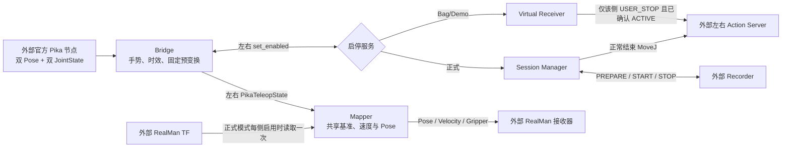

# Pika 双手遥操与 RealMan 数据采集接口

本仓库接收 Pika 双 Sense 的位姿和夹爪数据，生成左右 RealMan 的笛卡尔目标。正式模式协调录制和正常结束后的回零；Bag 模式可在单侧正常停止后异步发送该侧复位 Goal。本仓库**不包含 RealMan 速度接收器、机器人 SDK 控制进程或 Recorder 的落盘实现**。接口已定义不代表外部设备和数据集已完成端到端验证。

## 运行环境

项目面向 Ubuntu 22.04、ROS 2 Humble 和 Python 3.10。以下是 **2026-10-08 部署机示例**，迁移到其他机器时请替换地址和设备路径：

| 项目 | 此机器示例 |
|---|---|
| 主机 | `user2-ThinkCentre-K70-06-CEL2`，`ssh user2@192.168.31.97` |
| 工作区 | `/home/user2/pika_teleop_ws`；官方 Pika 工作区 `/home/user2/pika_ros` |
| ROS 域 | `ROS_DOMAIN_ID=65` |
| 左右夹爪串口别名 | `/dev/pika_gripper_left`、`/dev/pika_gripper_right` |

本机别名由 USB 物理插口规则生成；换插口后需重新核对左右对应关系，不能直接假设 `ttyUSB0/1` 顺序固定。仓库配置文件的实际后缀是 `.yam`。

## 架构与模式


```mermaid
flowchart LR
  O[外部官方 Pika 节点<br/>双 Pose + 双 JointState] --> B[Bridge<br/>手势、时效、固定预变换]
  B -->|左右 PikaTeleopState| M[Mapper<br/>共享基准、速度与 Pose]
  M -->|Pose / Velocity / Gripper| X[外部 RealMan 接收器]
  B <-->|左右 set_enabled| G{启停服务}
  G -->|正式| S[Session Manager]
  G -->|Bag/Demo| V[Virtual Receiver]
  S <-->|PREPARE / START / STOP| R[外部 Recorder]
  S -->|正常结束 MoveJ| A[外部左右 Action Server]
  V -->|仅该侧 USER_STOP 且已确认 ACTIVE| A
  T[外部 RealMan TF] -->|正式模式每侧启用时读取一次| M
```

| 模式 | Launch | 本仓库启动的节点 | 外部依赖 |
|---|---|---|---|
| 正式 | `pika_teleop.launch.py` | Session Manager、Bridge、Mapper | 官方 Pika 输入、RealMan TCP TF、Recorder、左右回零 Action、实际运动接收器 |
| Bag/Demo | `pika_bag.launch.py` | Virtual Receiver、Bridge、Mapper | 官方 Pika 输入；用配置的 TCP 起点代替 RealMan TF；启用正常 STOP 复位时需要对应 RealMan Action Server |

两模式提供同名 `/pika_teleop/left|right/set_enabled` 服务，**不能同时运行**。Bag launch 不启动 Recorder、Session Manager 或 Action Server，也不会自动执行 `ros2 bag record`；Virtual Receiver 在正常 USER_STOP 后可向外部 Action Server 发 Goal。两份 launch 默认 `start_pika_official:=false`；若官方节点已运行，不要再将其设为 `true`。设为 `true` 时，launch 使用进程组 supervisor 启动官方栈，并在退出时清理该组子进程；这项清理不解决官方位姿断流或定位质量问题。

## 九个 Package

| Package | 职责 |
|---|---|
| `pika_teleop_interfaces` | `PikaTeleopState` 消息与 `SetTeleopEnabled` 服务 |
| `pika_teleop_bridge` | 缓存四路官方输入、双击/三击、输入时效与跳变检查、固定预变换、左右 State |
| `pika_realman_mapper` | 共享 Pika 基准标定、每侧启动零位、Pose/速度/夹爪目标与虚拟 TF |
| `pika_session_manager` | 正式模式的全局录制 episode、准入、停止与正常结束回零 |
| `pika_teleop_virtual_receiver` | Bag 模式的启停服务、State watchdog，以及可选的单侧正常 STOP 复位 Goal |
| `pika_teleop_bringup` | 两份 launch、supervisor 与两份 `.yam` 配置 |
| `pika_foot_pedal` | 单脚踏板双臂踩一次启动、再踩一次停止；evdev 输入与 Bridge 手动启停服务 |
| `realman_msgs` | 外部 RealMan 控制与回零所需的接口定义 |
| `realman_recording_msgs` | 外部 Recorder 的管理服务和状态消息定义 |

## 数据与坐标

Bridge 以 `RELIABLE + VOLATILE + KEEP_LAST(1)` 订阅 `/pika_pose_l`、`/pika_pose_r`（`PoseStamped`）和 `/gripper_l/joint_state`、`/gripper_r/joint_state`（`JointState`）。它以 **20 Hz** 发布 `/pika_teleop/left|right/state`（`PikaTeleopState`，`BEST_EFFORT + VOLATILE + depth 1`）。State 含转换后的 `pose`、`twist`、`gripper_position`、`enabled`、`valid`、`velocity_valid`、两路源时间戳及数据年龄。Bridge 的固定预变换是 `(x,y,z)→(-z,y,x)`，State 的 `header.frame_id` 为 `pika_teleop_frame`。

Mapper 在此预变换结果上，用稳定的左右 Pika 样本建立共享基准：原点取双侧中点，Y 从左指向右，Z 取 Pika 竖直轴，X 由 `Y×Z` 得出。标定仅在节点启动后完成一次。正式模式每侧启用时读取一次相应 RealMan 基座到 TCP 的 TF（坐标变换树），把当前 Pika 原点与该侧 TCP 原点对齐；Bag 模式使用 YAML 中的默认 TCP 位姿。没有所需 TF 时，正式 Mapper 等待，不建立该侧目标会话。启动后的位置变化按共享基准求差，不再按手柄初始朝向额外旋转。角速度按同一基准轴求导；兼容用 Pose 的姿态模式独立配置。详见 [Mapper 说明](src/pika_realman_mapper/README.md)。

Mapper 对已启用且有效的侧以 **20 Hz** 发布 `/pika/l|r/cartesian_pose`（`PoseStamped`）和 `/pika/l|r/cartesian_velocity`（`TwistStamped`）；夹爪 `/pika/l|r/gripper_percentage`（`Float32`，0–1）由独立限频器默认以**最多 4 Hz** 发布。命令 Topic 是 `RELIABLE + VOLATILE + depth 1`，线速度单位 m/s，角速度 rad/s。

**`frame_id` 分开配置**：正式 Pose 为 `l/base_link`、`r/base_link`，Bag Pose 为 `l/work/pikabase`、`r/work/pikabase`；两模式速度均标记为 `l/work/pikabase`、`r/work/pikabase`。`l/link_6`、`r/link_6` 是启动时读取的 TCP TF 名称，不是速度消息的 `frame_id`。这些命名和数值在外部运动接收器中的解释仍须逐轴实测确认。

## 启停、录制与安全

左右双击或 `scripts/pika_start.sh` 发起 START，三击或 `scripts/pika_stop.sh` 发起 USER_STOP。脚本调用 Bridge 的 `/pika_teleop/left|right/manual_enable`；Bridge 再调用本模式的 `/pika_teleop/left|right/set_enabled`。正式模式还通过 `/pika_session/start_allowed` 限制新 START，并以 `/pika_session/state` 报告全局状态。

两份 launch 在本机默认 `start_foot_pedal:=true`。安装 `python3-evdev` 并确认用户可读脚踏板 `/dev/input/by-id/usb-0483_5750-if01-event-kbd` 后，原命令 `ros2 launch pika_teleop_bringup pika_bag.launch.py start_pika_official:=true pika_ros_ws:=/home/user2/pika_ros` 会同时启动官方节点和脚踏节点；正式模式可用 `pika_teleop.launch.py`。若要禁用脚踏，传 `start_foot_pedal:=false`。脚踏模式下夹爪手势判定停用但夹爪数据照常下发；踩一次先左后右启动，再踩一次停止，松脚不停止。`/foot_pedal/pressed` 是短暂物理按键状态，`/foot_pedal/enabled` 是逻辑启停请求状态。设备路径、键码、消抖和重复触发保护可由 launch 参数覆盖，详见 [脚踏板说明](src/pika_foot_pedal/README.md)。脚踏板不是硬件急停，归位完成需人工确认。

正式模式主流程：`PREPARING → READY → STARTING → RECORDING → STOPPING → RESETTING → PREPARING`。首次 START 要等待外部 Recorder 成功返回；另一侧可加入同一 recording session。任一侧正常 USER_STOP 会结束整个 episode：先停止两侧，再请求 Recorder STOP；成功后通过外部 `/l/execute_motion`、`/r/execute_motion` 并行 MoveJ 回零。`STALE_STOP` 或 `POSE_JUMP_STOP` 会停止录制并进入 `FAILED`，**不会自动 MoveJ**。录制或回零失败也进入 `FAILED`，需人工排查并重启 Session Manager。`middle_reset_joint_degrees` 仅校验保存，当前不发送中臂 Action。

Bag 模式的 `reset_on_user_stop=true` 只处理**已确认 ACTIVE 的该侧**正常 `USER_STOP`：Virtual Receiver 接受 STOP 后等待该请求之后的新 disabled State，再按 Bag YAML 的 `reset_dispatch_delay_ms`（当前试验值 4000 ms）延迟，向该侧 `/l/execute_motion` 或 `/r/execute_motion` 异步发送预设六关节 `MOVEJ` Goal。`STALE_STOP`、`POSE_JUMP_STOP`、watchdog 超时、未真正启动、重复 STOP 均不会触发复位；缺失 Action Server 只告警，不影响 STOP。**Goal 发出或被接受都不代表实际回到预设关节角**；节点不等待动作结果。必须现场确认对应机械臂已停止运动后，才能再次 START。可在 [Bag YAML](src/pika_teleop_bringup/config/ros/pika_bag_config.yam) 将 `reset_on_user_stop` 设为 `false` 关闭此功能。

Bridge 原始输入超时会停止该侧；Mapper 的 State watchdog 会停止对应目标并要求重新启用；外部 RealMan 接收器仍需自己实现命令超时、限位和急停。Recorder 真正写盘、相机健康和真机响应由外部系统负责，单凭本仓库代码无法证明。

## 构建与运行

在目标 Ubuntu 机器的新终端执行：

```bash
cd ~/pika_teleop_ws
source /opt/ros/humble/setup.bash
source ~/pika_ros/install/setup.bash
colcon build --symlink-install
source install/setup.bash
export ROS_DOMAIN_ID=65                 # 此机器示例；跨机器需与同组节点一致
```

官方 Pika 已在同一 ROS 域运行时，任选**一种**模式：

```bash
ros2 launch pika_teleop_bringup pika_teleop.launch.py
# 或：ros2 launch pika_teleop_bringup pika_bag.launch.py
```

需要由本 launch 启动官方 Pika 时，在所选命令后追加 `start_pika_official:=true`。官方工作区或设备别名不同，可同时追加 `pika_ros_ws:=/实际路径`、`left_serial_port:=/设备路径`、`right_serial_port:=/设备路径`。停止时在启动终端按 Ctrl+C；由该 launch 启动的官方进程交给 supervisor 清理。启动前需确保本模式的外部依赖已就绪，首次真机动作应低速、空载、保持急停可用。

## 当前参数速览

表中“默认”来自代码，“正式/Bag”来自已提交 YAML；未写入 YAML 时按默认生效。部署机若有未提交配置，以该机运行时参数为准，差异见 [LOG](LOG.md)。

| 项目 | 代码默认 | 正式 | Bag |
|---|---:|---:|---:|
| Bridge `state_rate_hz` | 100 Hz | **20 Hz** | **20 Hz** |
| Bridge `stale_stop_ms` | 50 ms | **50 ms**（YAML 未写） | **2000 ms** |
| Bridge `velocity_max_dt_ms` | 50 ms | 150 ms | 150 ms |
| Mapper `command_rate_hz` | 100 Hz | **20 Hz** | **20 Hz** |
| Mapper `state_timeout_ms` | 100 ms | 200 ms | 200 ms |
| Mapper `gripper_publish_rate_hz` | 4 Hz | 4 Hz（YAML 未写） | 4 Hz（YAML 未写） |
| Mapper 求导窗口 | 2 帧 | 5 帧 | 5 帧 |
| Mapper 卡尔曼 / 低通 | 关 / 10 Hz | 开 / 10 Hz | 开 / 10 Hz |
| 线速度 / 角速度死区 | 0.02 m/s / 0.03 rad/s | **0.005 m/s / 0.012 rad/s** | **0.005 m/s / 0.012 rad/s** |
| 夹爪全开原始值 | 0.1 | 0.0967 | 0.0967 |
| Virtual Receiver `state_timeout_ms` | 100 ms | 不启动 | **2000 ms** |

PoseJump 使用代码默认 `0.08 m`、`45°`。正式模式 `require_realman_start_tf=true`，Bag 为 `false`。Bag 复位关节角和 Action 参数已单独复制进 Bag YAML，运行时不读取正式 YAML。配置文件为 [正式 YAML](src/pika_teleop_bringup/config/ros/pika_config.yam) 与 [Bag YAML](src/pika_teleop_bringup/config/ros/pika_bag_config.yam)；参数含义见 [Bridge](src/pika_teleop_bridge/README.md)、[Mapper](src/pika_realman_mapper/README.md) 和 [Bringup](src/pika_teleop_bringup/README.md)。修改配置后重启 launch；非软链接构建还需重建安装目录。

## 检查与日志

在已完成 `source` 且 `ROS_DOMAIN_ID` 一致的终端：

```bash
ros2 node list
ros2 topic hz /pika_teleop/left/state
ros2 topic info -v /pika_teleop/left/state
ros2 topic echo /pika_teleop/left/state --qos-reliability best_effort
ros2 topic echo /pika/l/cartesian_velocity --qos-reliability reliable
ros2 service list | grep pika_teleop
ros2 topic echo /pika_session/state --qos-durability transient_local  # 仅正式模式
tail -n 100 ~/.ros/log/pika_teleop_latest/launch.log
```

Launch 会尝试把 `~/.ros/log/pika_teleop_latest` 链到本次日志目录，并写 `run_info.txt`；写入失败会被忽略，应以 launch 实际输出目录为准。`scripts/limit_pika_locator_logs.py` 仅抑制官方定位器的重复 WARN，**不会修复数据断流**。需要演示录包时，另开终端手动执行 `ros2 bag record`，具体命令见 [Bringup](src/pika_teleop_bringup/README.md)。

## 进一步阅读

- [Bridge：输入、手势和 State](src/pika_teleop_bridge/README.md)
- [Mapper：基准、TF、速度和参数](src/pika_realman_mapper/README.md)
- [Session Manager：录制与回零状态机](src/pika_session_manager/README.md)
- [Virtual Receiver：Bag 模式 watchdog](src/pika_teleop_virtual_receiver/README.md)
- [Bringup：两种 launch 和录包命令](src/pika_teleop_bringup/README.md)
- [LOG：文档同步记录与未验证事项](LOG.md)
