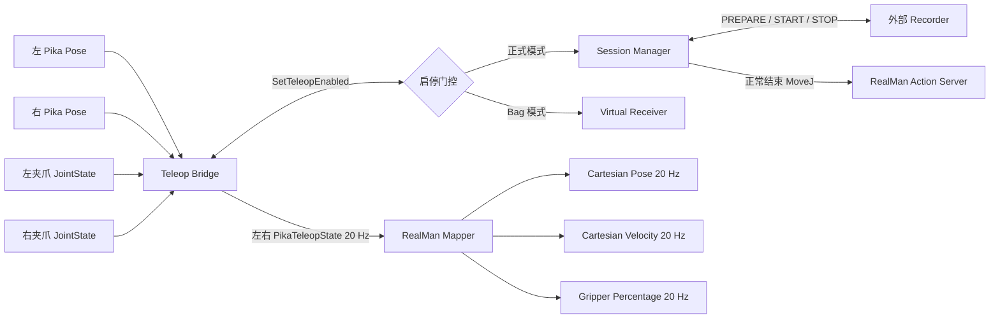

# Pika 双手遥操与 RealMan 数据采集系统

本仓库把 Pika 双 Sense 的位姿和夹爪数据转换成左右 RealMan 机械臂可使用的笛卡尔目标，并提供手势启停、录制门控、异常停机和正常结束回零。

本文档以 `main` 分支的功能提交 `9e99758` 为实现基线。当前版本的 State 发布和目标下发频率均为 20 Hz；角速度单位为 rad/s；线速度小于 0.02 m/s、角速度小于 0.03 rad/s 时输出归零；左右夹爪全开标定值为 0.0967。

## 本机环境

| 项目 | 当前值 |
|---|---|
| 主机 | `user2-ThinkCentre-K70-06-CEL2` |
| 登录 | `ssh user2@192.168.5.152` |
| 系统 | Ubuntu 22.04.5 LTS |
| ROS 2 | Humble |
| Python | 3.10.12 |
| ROS Domain | `65` |
| 遥操工作区 | `/home/user2/pika_teleop_ws` |
| 官方 Pika 工作区 | `/home/user2/pika_ros` |
| 左 Sense 串口 | `/dev/ttyUSB50`，当前指向 `ttyUSB3` |
| 右 Sense 串口 | `/dev/ttyUSB51`，当前指向 `ttyUSB2` |

`/dev/ttyUSB50` 和 `/dev/ttyUSB51` 是本机固定入口。底层 `ttyUSB2/3` 可能因重插或重启变化，启动命令应继续使用固定入口。

每个新终端先加载环境：

```bash
source /opt/ros/humble/setup.bash
source ~/pika_ros/install/setup.bash
source ~/pika_teleop_ws/install/setup.bash
export ROS_DOMAIN_ID=65
```

两份 launch 会为本项目 Python 节点补齐安装路径，避免出现 `PackageNotFoundError`。仍建议按上述顺序加载环境，保证 ROS 接口、官方节点和命令行工具都来自正确工作区。

## 当前架构


```mermaid
flowchart LR
    PL[左 Pika Pose] --> B[Teleop Bridge]
    PR[右 Pika Pose] --> B
    GL[左夹爪 JointState] --> B
    GR[右夹爪 JointState] --> B

    B -->|左右 PikaTeleopState 20 Hz| M[RealMan Mapper]
    B <-->|SetTeleopEnabled| G{启停门控}

    G -->|正式模式| S[Session Manager]
    S <-->|PREPARE / START / STOP| R[外部 Recorder]
    S -->|正常结束 MoveJ| A[RealMan Action Server]

    G -->|Bag 模式| V[Virtual Receiver]

    M --> CP[Cartesian Pose 20 Hz]
    M --> CV[Cartesian Velocity 20 Hz]
    M --> GP[Gripper Percentage 20 Hz]
```

系统分为两条运行路径：

| 模式 | Launch | 启停服务提供者 | 录制与回零 | 用途 |
|---|---|---|---|---|
| 正式模式 | `pika_teleop.launch.py` | `pika_session_manager` | 启用 | 真机采集、Recorder 联动、正常结束双臂回零 |
| Bag/Demo 模式 | `pika_bag.launch.py` | `pika_teleop_virtual_receiver` | 不启用 | 调试 Pika、验证映射与 Topic，不依赖 Recorder |

官方 Pika 节点属于 `/home/user2/pika_ros`，本项目默认不修改其发布频率和实现。`start_pika_official` 只决定 launch 是否代为启动官方节点。

## Package 职责

| Package | 作用 |
|---|---|
| `pika_teleop_interfaces` | 定义标准状态 `PikaTeleopState` 和启停服务 `SetTeleopEnabled` |
| `pika_teleop_bridge` | 缓存四路官方输入，检查时效与数值，识别手势，转换坐标，以 20 Hz 发布标准状态 |
| `pika_realman_mapper` | 建立每侧会话零位，生成 RealMan 位姿、速度和夹爪百分比目标 |
| `pika_session_manager` | 正式模式的录制状态机、左右臂协同停止和正常结束回零 |
| `pika_teleop_virtual_receiver` | Bag 模式的轻量启停服务和 State/watchdog 验证 |
| `pika_teleop_bringup` | 正式与 Bag launch、共享 ROS 参数配置 |
| `realman_msgs` | RealMan 控制、运动和回零 Action/Service 接口 |
| `realman_recording_msgs` | Recorder 状态及 PREPARE/START/STOP 接口 |

## 工作流程

### 1. 输入采集

Bridge 异步订阅四路官方数据，QoS 为 `RELIABLE + VOLATILE + KEEP_LAST(1)`：

| Topic | 类型 | 用途 |
|---|---|---|
| `/pika_pose_l` | `geometry_msgs/PoseStamped` | 左侧位姿 |
| `/pika_pose_r` | `geometry_msgs/PoseStamped` | 右侧位姿 |
| `/gripper_l/joint_state` | `sensor_msgs/JointState` | 左侧夹爪及手势 |
| `/gripper_r/joint_state` | `sensor_msgs/JointState` | 右侧夹爪及手势 |

订阅回调只保存最新样本。Bridge 的 20 Hz 控制周期读取最新值，不会要求四个 Topic 严格同步，也不会修改官方节点的原始发布频率。

### 2. 输入有效性和手势

一侧输入必须同时满足以下条件才可进入或保持 ACTIVE：

- 位姿和夹爪都已收到；
- 位置、四元数和夹爪值为有限数；
- 四元数可归一化；
- 位姿与夹爪年龄均不超过 `stale_stop_ms`；
- ACTIVE 后相邻新位姿没有超过 PoseJump 阈值。

手势按夹爪开合次数识别：

- IDLE 时连续双击：请求 `USER_START`；
- ACTIVE 时连续三击：请求 `USER_STOP`；
- PENDING_START 期间不重复识别新手势。

Bridge 先在本地停止，再异步通知下游，因此 Recorder 或服务响应变慢不会阻塞 20 Hz 控制周期。

### 3. 正式模式启动

Session Manager 启动后先向 Recorder 发送 PREPARE：

```text
PREPARING -> READY -> STARTING -> RECORDING
```

第一侧双击时：

1. Bridge 请求该侧 `set_enabled=true`；
2. Session Manager 要求 Recorder START；
3. Recorder 返回成功和 `session_id` 后进入 RECORDING；
4. Bridge 收到成功响应后将该侧切到 ACTIVE。

第二侧随后双击时直接加入同一录制 session，不会再次启动 Recorder。

任意一侧正常三击停止后：

```text
RECORDING -> STOPPING -> RESETTING -> PREPARING -> READY
```

系统会停止两侧遥操、停止录制，然后分别调用 `/l/execute_motion` 和 `/r/execute_motion` 执行 MoveJ 回零。只有两侧都成功后才重新 PREPARE。

发生 `STALE_STOP`、`POSE_JUMP_STOP` 等异常时，Session Manager 停止录制并进入 FAILED，不自动移动机械臂，避免异常状态下自动回零。

### 4. Bag/Demo 模式启动

Virtual Receiver 直接接受启停请求，不连接 Recorder，也不执行回零。其职责是：

- 接受或拒绝 `SetTeleopEnabled`；
- 检查 State 接收超时；
- 在 enabled/valid、watchdog 或数据异常变化时记录一次日志；
- 默认不打印每秒完整摘要，避免终端和 ROS 日志持续刷写。

### 5. 相对位姿映射

每侧第一次收到 `enabled=true && valid=true` 的 State 时，Mapper 保存：

- 当前 Pika 位姿作为 `pika_start`；
- YAML 中配置的 RealMan TCP 位姿作为 `rm_start`。

之后的目标始终由“当前 Pika 相对起点的变化”映射到固定 RealMan 起点，不做累计积分：

```text
target_position = rm_start_position
                + R(base_from_pika)
                * translation_scale
                * (pika_current_position - pika_start_position)
```

姿态使用相同的固定坐标映射处理 Pika 相对旋转，再作用到 `rm_start_orientation`。每次停止都会清空零位；再次启动重新采样 Pika 起点。

### 6. 速度生成

Mapper 根据相邻目标位姿和 Pika 源时间戳求导，输出：

- 线速度：m/s；
- 角速度：rad/s。

速度经过一阶低通滤波。若相邻样本间隔无效或超过 `velocity_max_dt_ms`，估计器重新建立基线，本次速度标记无效。

当前版本还有两个代码固定死区：

- 滤波后线速度向量模长 `< 0.02 m/s` 时，线速度三轴全部归零；
- 滤波后角速度向量模长 `< 0.03 rad/s` 时，角速度三轴全部归零。

这两个值目前不在 YAML 中，如需调整要修改 `pika_realman_mapper/velocity.py`。

## ROS 2 接口

### 标准 State

| Topic | 类型 | 频率与 QoS |
|---|---|---|
| `/pika_teleop/left/state` | `pika_teleop_interfaces/msg/PikaTeleopState` | 20 Hz，BEST_EFFORT，VOLATILE，depth 1 |
| `/pika_teleop/right/state` | `pika_teleop_interfaces/msg/PikaTeleopState` | 20 Hz，BEST_EFFORT，VOLATILE，depth 1 |

`PikaTeleopState` 包含转换后 Pose、Twist、夹爪原始值、`enabled`、`valid`、`velocity_valid`、源时间戳以及数据年龄。

### 启停服务

| Service | 类型 |
|---|---|
| `/pika_teleop/left/set_enabled` | `pika_teleop_interfaces/srv/SetTeleopEnabled` |
| `/pika_teleop/right/set_enabled` | `pika_teleop_interfaces/srv/SetTeleopEnabled` |

### Mapper 输出

| Topic | 类型 | 单位/范围 |
|---|---|---|
| `/pika/l/cartesian_pose` | `geometry_msgs/PoseStamped` | m、四元数 |
| `/pika/r/cartesian_pose` | `geometry_msgs/PoseStamped` | m、四元数 |
| `/pika/l/cartesian_velocity` | `geometry_msgs/TwistStamped` | m/s、rad/s |
| `/pika/r/cartesian_velocity` | `geometry_msgs/TwistStamped` | m/s、rad/s |
| `/pika/l/gripper_percentage` | `std_msgs/Float32` | 0.0 到 1.0 |
| `/pika/r/gripper_percentage` | `std_msgs/Float32` | 0.0 到 1.0 |

Mapper 节点启动后 Topic 会存在，但只有对应侧 State 同时满足 `enabled=true && valid=true` 时才发布目标消息。

### Session 接口

| 接口 | 类型 | 作用 |
|---|---|---|
| `/pika_session/state` | `std_msgs/String` | 当前 Session 状态，TRANSIENT_LOCAL |
| `/pika_session/start_allowed` | `std_msgs/Bool` | Bridge 是否允许请求 START，TRANSIENT_LOCAL |
| `/pika_session/force_stop_all` | `std_msgs/Empty` | 强制 Bridge 两侧停止 |
| `/recording/manage` | `realman_recording_msgs/srv/ManageRecording` | Recorder PREPARE/START/STOP |
| `/recording/status` | `realman_recording_msgs/msg/RecordingStatus` | Recorder 状态 |
| `/l/execute_motion` | `realman_msgs/action/ExecuteMotion` | 左臂回零 |
| `/r/execute_motion` | `realman_msgs/action/ExecuteMotion` | 右臂回零 |

## 配置文件

| 文件 | 使用模式 |
|---|---|
| `src/pika_teleop_bringup/config/ros/pika_config.yam` | 正式模式 |
| `src/pika_teleop_bringup/config/ros/pika_bag_config.yam` | Bag/Demo 模式 |

修改 YAML 后必须重启对应 launch。使用 `--symlink-install` 构建后，安装目录会链接到源码配置；如果不是软链接构建，则需要重新执行 `colcon build`。

### Bridge 参数

| 参数 | 正式值 | Bag 值 | 作用与影响 |
|---|---:|---:|---|
| `state_rate_hz` | 20 | 20 | State 发布和 Bridge 控制周期。增大可降低周期延迟，但增加 CPU、DDS 和日志/监控压力 |
| `use_session_gate` | `true` | `false` | 正式模式只有 Session READY/RECORDING 时允许启动；Bag 模式直接请求 Virtual Receiver |
| `stale_stop_ms` | 未写入，生效默认 50 | 100 | 位姿或夹爪超过该年龄即不可用；ACTIVE 时触发 `STALE_STOP`。越小越安全敏感，越大越能容忍卡顿但停机更慢 |
| `start_service_timeout_ms` | 10000 | 10000 | START 服务最长等待时间；超时后返回 IDLE |
| `velocity_max_dt_ms` | 150 | 150 | Bridge 自身 State Twist 的最大连续采样间隔；超过后速度重新建基线 |

Bridge 还支持以下参数，但当前 YAML 未显式写入，使用代码默认值：

| 参数 | 默认值 | 作用与影响 |
|---|---:|---|
| `gripper_open_threshold` | 0.075 | 高于此值判定夹爪打开 |
| `gripper_close_threshold` | 0.025 | 低于此值判定夹爪闭合；与打开阈值形成迟滞，减少抖动误触发 |
| `click_max_interval_ms` | 450 | 相邻有效点击允许的最大间隔；过小难触发，过大容易把独立动作合并 |
| `gesture_reset_timeout_ms` | 1200 | 手势序列无新动作多久后清空 |
| `max_position_jump_m` | 0.08 | ACTIVE 时单个新 Pose 允许的最大位置跳变，超过触发 `POSE_JUMP_STOP` |
| `max_rotation_jump_deg` | 45 | ACTIVE 时单个新 Pose 允许的最大旋转跳变 |
| `velocity_filter_cutoff_hz` | 10 | Bridge State Twist 的低通截止频率；越低越平滑但延迟更大 |

如需让正式与 Bag 的 `stale_stop_ms` 完全一致，应在 `pika_config.yam` 中显式加入该参数，避免正式模式继续使用默认 50 ms。

### Mapper 参数

| 参数 | 正式值 | Bag 值 | 作用与影响 |
|---|---:|---:|---|
| `command_rate_hz` | 20 | 20 | 位姿、速度、夹爪目标的下发频率 |
| `state_timeout_ms` | 200 | 200 | 超过该时间未收到新 State 时停止输出，并要求先看到 disabled 才能重新启动 |
| `left_base_frame` | `l/base_link` | `l/work/pikabase` | 左目标消息的 frame_id，必须与下游控制链约定一致 |
| `right_base_frame` | `r/base_link` | `r/work/pikabase` | 右目标消息的 frame_id |
| `left_default_tcp_position_m` | `[-0.323,-0.028,0.304]` | 相同 | 左臂每次会话的固定 TCP 起点，单位 m |
| `right_default_tcp_position_m` | `[-0.299,0.014,0.319]` | 相同 | 右臂固定 TCP 起点，单位 m |
| `*_default_tcp_orientation_xyzw` | 见 YAML | 相同 | 固定 TCP 起始姿态，顺序为 x/y/z/w，必须是可归一化四元数 |
| `*_base_from_pika_quaternion_xyzw` | `[0.70710678,0,-0.70710678,0]` | 相同 | Pika 坐标到机械臂基坐标的固定旋转；修改会改变各轴方向和姿态映射 |
| `translation_scale_left/right` | 1.0 | 1.0 | Pika 平移到目标平移的倍率；大于 1 放大动作，小于 1 缩小动作 |
| `*_gripper_closed_position` | 0.0 | 0.0 | 映射为夹爪百分比 0.0 的原始值 |
| `*_gripper_open_position` | 0.0967 | 0.0967 | 映射为夹爪百分比 1.0 的原始值；区间外会截断到 0 或 1 |
| `velocity_filter_cutoff_hz` | 10 | 10 | Mapper 速度低通截止频率；降低更平滑，增大更灵敏但噪声更多 |
| `velocity_max_dt_ms` | 150 | 150 | 目标速度允许的最大样本间隔；超过后清零并重新建立速度基线 |

左右默认 TCP 是每次启动遥操时的目标零位，并不会读取当前机械臂 TF。修改前应确认机械臂实际起始姿态与配置一致。

### Session Manager 参数（仅正式模式）

| 参数 | 当前值 | 作用与影响 |
|---|---:|---|
| `recording_service` | `/recording/manage` | Recorder 管理服务名称 |
| `recording_status_topic` | `/recording/status` | Recorder 状态 Topic；当前节点保留该接口配置 |
| `recording_profile` | `teleop_v1` | START 请求使用的录制 profile |
| `recording_task` | `pick_and_place` | 数据集任务标签 |
| `recording_duration_sec` | 0 | 0 表示不设置固定时长，由 STOP 结束；正数交由 Recorder 限时 |
| `record_cameras` | `true` | PREPARE/START 时请求 Recorder 录制相机；图像由相机节点产生，文件由 Recorder 写入 |
| `prepare_retry_sec` | 2.0 | PREPARE 失败或服务未就绪时的重试间隔 |
| `left_reset_action` | `/l/execute_motion` | 左臂回零 Action |
| `right_reset_action` | `/r/execute_motion` | 右臂回零 Action |
| `left_reset_joint_degrees` | `[12.172,25.223,73.054,-16.703,80.307,14.455]` | 左臂正常结束后的 6 轴目标角，单位 deg |
| `right_reset_joint_degrees` | `[-9.89,18.046,79.074,15.505,79.606,-6.194]` | 右臂回零目标角，单位 deg |
| `middle_reset_joint_degrees` | `[0,17.997,70,0,90,8.997]` | 当前版本仅校验并保留，未向中臂发送 Action |
| `reset_velocity_percent` | 10 | 回零速度百分比，范围 0–100 |
| `reset_blend_radius_percent` | 0 | 回零轨迹交融比例，0 表示不交融 |
| `reset_timeout_sec` | 120 | 单侧回零 Action 超时参数 |

### Virtual Receiver 参数（仅 Bag 模式）

| 参数 | 当前值 | 作用与影响 |
|---|---:|---|
| `accept_start` | `true` | 是否接受 `enable=true`；设为 false 可测试 START 被拒绝 |
| `state_timeout_ms` | 200 | 多久未收到 State 后将控制门标记为 BLOCKED |
| `state_transition_warn_ms` | 未写入，默认 100 | 服务接受启停后，State 的 enabled 未在该时间内变化则警告 |
| `periodic_summary` | 未写入，默认 `false` | true 时每秒打印完整左右摘要；会增加终端和日志写入量，日常运行建议保持 false |

## 构建

```bash
cd ~/pika_teleop_ws
source /opt/ros/humble/setup.bash
source ~/pika_ros/install/setup.bash
colcon build --symlink-install
source install/setup.bash
```

只修改 Mapper 或配置时可缩小构建范围：

```bash
colcon build --packages-select pika_realman_mapper pika_teleop_bringup --symlink-install
```

## 启动

### 官方 Pika 已单独启动

终端 1：

```bash
source /opt/ros/humble/setup.bash
source ~/pika_ros/install/setup.bash
export ROS_DOMAIN_ID=65
ros2 launch sensor_tools open_multi_sensor_with_teleop.launch.py \
  l_serial_port:=/dev/ttyUSB50 r_serial_port:=/dev/ttyUSB51
```

终端 2，正式模式：

```bash
source /opt/ros/humble/setup.bash
source ~/pika_ros/install/setup.bash
source ~/pika_teleop_ws/install/setup.bash
export ROS_DOMAIN_ID=65
ros2 launch pika_teleop_bringup pika_teleop.launch.py
```

终端 2，Bag/Demo 模式：

```bash
source /opt/ros/humble/setup.bash
source ~/pika_ros/install/setup.bash
source ~/pika_teleop_ws/install/setup.bash
export ROS_DOMAIN_ID=65
ros2 launch pika_teleop_bringup pika_bag.launch.py
```

### 由本项目同时启动官方 Pika

正式模式：

```bash
ros2 launch pika_teleop_bringup pika_teleop.launch.py \
  start_pika_official:=true \
  pika_ros_ws:=/home/user2/pika_ros \
  left_serial_port:=/dev/ttyUSB50 \
  right_serial_port:=/dev/ttyUSB51
```

Bag/Demo 模式：

```bash
ros2 launch pika_teleop_bringup pika_bag.launch.py \
  start_pika_official:=true \
  pika_ros_ws:=/home/user2/pika_ros \
  left_serial_port:=/dev/ttyUSB50 \
  right_serial_port:=/dev/ttyUSB51
```

launch 参数均通过 `$HOME` 和传入路径解析，不依赖旧用户名 `Lei`。

## 运行检查

确认关键节点：

```bash
ros2 node list | grep -E 'pika_teleop|pika_realman|pika_session'
```

确认关键 Topic：

```bash
ros2 topic list | grep -E 'pika_teleop|/pika/[lr]/cartesian|gripper_percentage'
```

测量频率：

```bash
ros2 topic hz /pika_teleop/left/state
ros2 topic hz /pika/l/cartesian_pose
```

查看当前状态：

```bash
ros2 topic echo --once /pika_teleop/left/state
ros2 topic echo --once /pika_session/state
```

查看角速度单位：

```bash
ros2 topic echo /pika/l/cartesian_velocity
```

其中 `twist.angular` 为 rad/s。

## 日志与常见现象

- `INPUT_UNUSABLE`：位姿或夹爪已收到，但数值无效或年龄超过 `stale_stop_ms`。日志会给出两种 age。
- `INPUT_RECOVERED`：此前不可用的输入重新满足条件；它是恢复提示，不会自动恢复一次已经停止的遥操。
- `STALE_STOP`：ACTIVE 时输入超时，Bridge 立即退回 IDLE。
- `POSE_JUMP_STOP`：ACTIVE 时相邻新 Pose 跳变超过阈值。
- `SESSION STOPPED: state watchdog timeout`：Mapper 超过 200 ms 没收到 State，停止目标输出并要求重新启停。
- Mapper Topic 存在但无消息：通常是对应 State 仍为 `enabled=false` 或 `valid=false`。
- 找不到 `/pika/{l,r}/cartesian_*`：检查 `/pika_realman_mapper` 是否存活；当前 launch 已补齐 Python 包路径。

本项目日志默认只在状态变化、故障和恢复时打印一次。Bag Virtual Receiver 的 `periodic_summary=false` 时不会每秒打印整帧数据。

ROS 日志位于 `~/.ros/log`。清理其中已经确认的历史运行目录不会改变代码、参数或 rosbag 数据，但应先停止 launch，并确认目标确实位于 `~/.ros/log`。Recorder 数据目录与这里无关，不要一并删除。

## 安全说明

- 第一次修改坐标四元数、默认 TCP、平移比例或回零关节角后，应先在低速、可急停条件下逐轴验证。
- `stale_stop_ms` 和 `state_timeout_ms` 是两层不同保护：前者检查官方原始数据，后者检查标准 State 链路。
- 放宽超时会减少误停，也会延长真实断流后的继续输出窗口。
- 正常 USER_STOP 才允许自动回零；异常停止保持 FAILED，需人工确认现场状态。
- 夹爪开合阈值用于手势识别，夹爪 closed/open position 用于输出百分比，两组参数作用不同。

## Git 状态

当前工作版本位于 `main`，最近提交：

```text
9e99758 保留速度死区与夹爪全开标定
```

实验分支 `feat/pika-velocity-gentle` 仍保留，但日常运行和后续修改应以 `main` 为准。当前本地 main 领先 `origin/main`，推送前先确认远端状态和提交范围。
